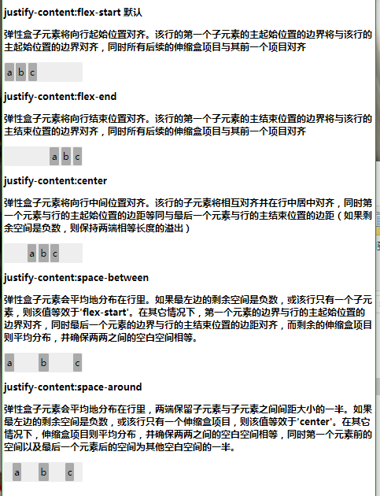

# Flex 弹性盒子
## 介绍
> 弹性布局（flexible box）模块,旨在提供一个更加有效的方式来布置，对齐和分布在容器之间的各项内容，即使它们的大小是未知或者动态变化的
> 弹性布局的主要思想是让容器有能力来改变项目的宽度和高度，以填满可用空间（主要是为了容纳所有类型的显示设备和屏幕尺寸）的能力
> flex不是单一的一个属性，包括它的整个属性集。一些设置是在父容器上，一些则设置在子容器上
> 父容器 ```display:-webkit-flex/inline-flex;display:flex/inline-flex;```

## 属性介绍
```
注意: 
1.css 列（CSS columns）在弹性盒子中不起作用
2.float, clear and vertical-align 在flex项目中不起作用
```
### flex-direction (适用于父类容器的元素上)
> 设置或检索伸缩盒对象的子元素在父容器中的位置
> -webkit-flex-direction: row | row-reverse | column | column-reverse

> 注意: lex生效需定义其父元素display为flex或inline-flex(box或inline-box，这是旧的方式)
### flex-wrap (适用于父类容器上)
> 设置或检索伸缩盒对象的子元素超出父容器时是否换行
> flex-wrap: nowrap(默认) | wrap | wrap-reverse

### flex-flow (适用于父类容器上)
> 复合属性。设置或检索伸缩盒对象的子元素排列方式，其实是把direction和wrap合起来的写法
> flex-flow: <‘flex-direction’> || <‘flex-wrap’>

### justify-content (适用于父类容器上)
> 设置或检索弹性盒子元素在主轴（横轴）方向上的对齐方式
> 当弹性盒里一行上的所有子元素都不能伸缩或已经达到其最大值时，这一属性可协助对多余的空间进行分配。当元素溢出某行时，这一属性同样会在对齐上进行控制
> justify-content: flex-start | flex-end | center | space-between | space-around


### align-items (适用于父类容器上)
> 设置或检索弹性盒子元素在侧轴（纵轴）方向上的对齐方式
> align-items: flex-start | flex-end | center | baseline | stretch

### align-content (适用于父类容器上)
> 设置或检索弹性盒堆叠伸缩行的对齐方式
> align-content: flex-start | flex-end | center | space-between | space-around | stretch

***
### order (适用于弹性盒模型容器子元素)
> 用整数值来定义排列顺序，数值小的排在前面。可以为负值
> `order: <integer>`

### flex-grow (适用于弹性盒模型容器子元素)
> 设置或检索弹性盒的扩展比率,根据弹性盒子元素所设置的扩展因子作为比率来分配剩余空间
> flex-grow: <number> (default 0)
> `<number>：用数值来定义扩展比率。不允许负值`
> `flex-grow的默认值为0，如果没有显示定义该属性，是不会拥有分配剩余空间权利的。本例中b,c两项都显式的定义了flex-grow，可以看到总共将除了a，d，e剩余空间分成了4份，其中b占1份，c占3分，即1:3`
```
li:nth-child(2){-webkit-flex-grow:1;flex-grow:1;}<br>li:nth-child(3){-webkit-flex-grow:2;flex-grow:2;}
```

### flex-shrink (适用于弹性盒模型容器子元素)
>设置或检索弹性盒的收缩比率(根据弹性盒子元素所设置的收缩因子作为比率来收缩空间)
> flex-shrink: <number> (default 1)
```
flex-shrink的默认值为1，如果没有显示定义该属性，将会自动按照默认值1在所有因子相加之后计算比率来进行空间收缩。
本例中c显式的定义了flex-shrink，a,b没有显式定义，但将根据默认值1来计算，可以看到总共将剩余空间分成了5份，其中a占1份，b占1份，c占3分，即1:1:3
我们可以看到父容器定义为400px，子项被定义为200px，相加之后即为600px，超出父容器200px。那么这么超出的200px需要被a,b,c消化
按照以上定义a,b,c将按照1:1:3来分配200px，计算后即可得40px,40px,120px，换句话说，a,b,c各需要消化40px,40px,120px，那么就需要用原定义的宽度相减这个值，最后得出a为160px，b为160px，c为80px
```
`li:nth-child(3){-webkit-flex-shrink:3;flex-shrink:3;}`

### flex (适用于弹性盒模型子元素)
> 复合属性。设置或检索伸缩盒对象的子元素如何分配空间
> 如果缩写flex:1, 则其计算值为：1 1 0
> flex：none | [ flex-grow ] || [ flex-shrink ] || [ flex-basis ]